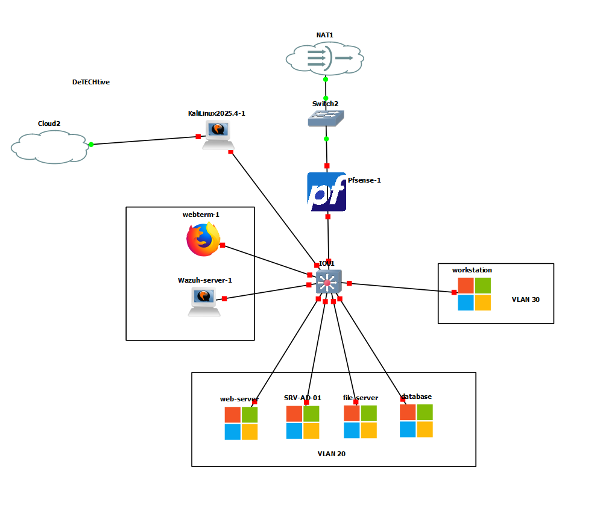
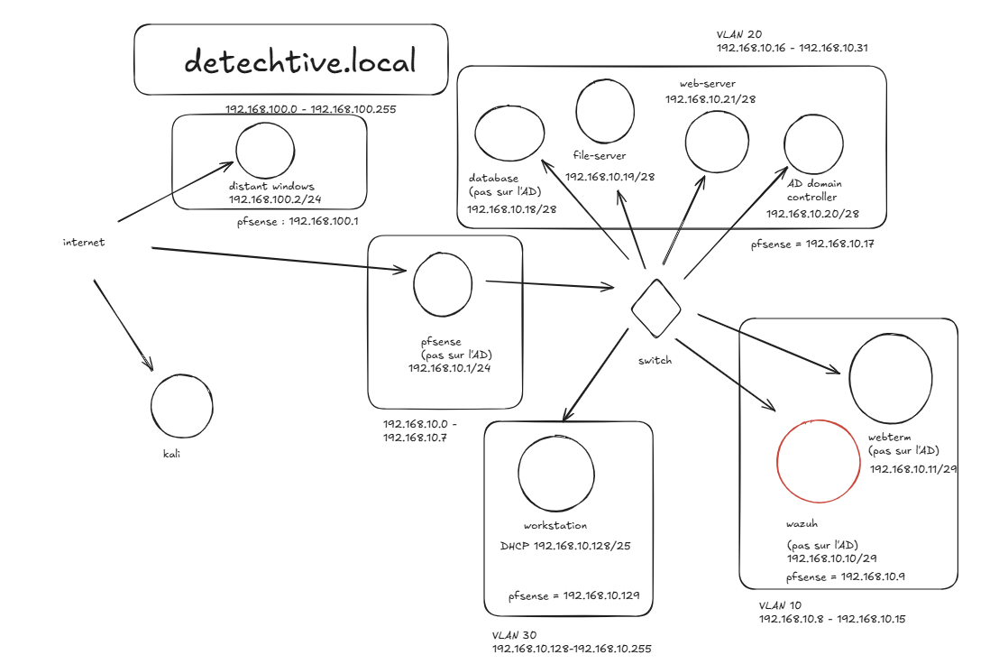

# 🕵️‍♂️ Detechtive Agency - Secure Infrastructure & Intranet

> **Projet de fin d'études - Certification AIS (Administrateur d'Infrastructures Sécurisées)**
> *RNCP Niveau 6 - Jedha Bootcamp - 2026*

---

## 📖 À propos

**Detechtive Agency** est un projet de mise en situation réelle simulant le déploiement d'une infrastructure sécurisée pour une agence de renseignement. Le projet couvre la conception de l'architecture réseau (SDN), la virtualisation, le durcissement des serveurs et le développement d'un intranet métier interconnecté aux services d'infrastructure critiques (AD, File Server, SGBD).

🎯 **Objectif :** Démontrer la capacité à concevoir une architecture **"Secure by Design"** en segmentant le réseau et en chiffrant les communications sensibles.

---

## 🏗️ Architecture & Infrastructure

L'infrastructure est entièrement virtualisée et émulée via **GNS3**. Elle repose sur une segmentation stricte pour limiter les mouvements latéraux en cas de compromission.

### 🗺️ Topologie Réseau
Le réseau est cloisonné en zones de sécurité (VLANs), filtrées par un pare-feu **pfSense** qui agit comme passerelle par défaut et routeur.

| Zone | VLAN | CIDR | Services Hébergés |
| :--- | :---: | :--- | :--- |
| **Management & Sécurité** | `10` | `192.168.10.8/29` | Serveur SIEM (Wazuh), Webterm d'administration |
| **Serveurs (DMZ Interne)** | `20` | `192.168.10.16/28` | Web (Apache), Contrôleur de Domaine (AD), File Server, DB (MariaDB) |
| **Postes Clients** | `30` | `192.168.10.128/25` | Workstations des agents (Windows) |
| **Zone Externe** | `-` | `WAN` | Poste Attaquant (Kali Linux) pour Pentest |

### 📸 Vue Logique (GNS3)
La topologie met en évidence le nœud central de commutation et la distribution des services critiques en VLAN 20.

*Schéma conceptuel (Plan d'adressage IP) :*

---

## 🛠️ Stack Technique

### 🖥️ Virtualisation & Réseau
* **Hyperviseur / Émulateur :** GNS3 (Gestion de la topologie), VMware.
* **Sécurité Périmétrique :** pfSense (Firewalling, NAT, Routing).
* **Supervision de Sécurité :** Wazuh (SIEM & XDR).

### ⚙️ Systèmes & Services
* **Windows Server 2019 :**
    * **Active Directory (AD DS) :** Gestion centralisée des identités et GPO.
    * **File Server :** Stockage des preuves avec permissions NTFS strictes.
    * **DNS / DHCP :** Résolution interne et adressage dynamique.
* **Linux (Debian 11/12) :**
    * Serveur Web (Apache2).
    * Serveur de Base de données (MariaDB).

### 💻 Application Intranet ("Detechtive Dashboard")
* **Frontend :** HTML5 / CSS3 (Design "Dark Mode" Terminal).
* **Backend :** PHP 8.x Natif.
* **Base de Données :** MySQL / MariaDB.
* **Outils de gestion :** Trello (Kanban), Excalidraw (Schémas).

---

## 🔐 Implémentations Sécurité (Focus AIS)

Ce projet met en œuvre des mécanismes de défense en profondeur :

### 1. Chiffrement des Flux Critiques
* **HTTPS Strict :** L'application web n'est accessible que via TLS.
* **Database SSL/TLS :** La connexion entre le backend PHP et la base de données MariaDB est forcée en SSL (certificats CA personnalisés).
    * *Vérification active du cipher SSL lors de la connexion PDO.*
* **SMB Signing :** Intégrité des échanges de fichiers assurée.

### 2. Gestion des Identités & Accès
* **Authentification Centralisée :** Les utilisateurs sont gérés via l'Active Directory.
* **Interopérabilité PHP ↔ Windows :** L'application web s'authentifie dynamiquement sur le File Server via `net use` pour monter les partages sécurisés, permettant de stocker les fichiers hors de la zone web (prévention des fuites de données).

### 3. Sécurité Applicative
* **Upload Sécurisé :** Liste blanche d'extensions (Whitelist), renommage aléatoire des fichiers, et désactivation de l'exécution dans les dossiers d'upload.
* **Protection SQL :** Utilisation systématique de requêtes préparées (`PDO` & `MySQLi`).
* **Confidentialité :** Désactivation des rapports d'erreurs PHP en production (`display_errors = Off`).

---

## 🚀 Installation / Déploiement (Simulation)

> ⚠️ **Note :** Le code source complet est privé. Ce dépôt sert de vitrine technique.

Pour reproduire cet environnement sous GNS3 :
1.  Importer les appliances (PfSense, Windows Server, Debian).
2.  Configurer les interfaces VLAN sur le switch virtuel.
3.  Déployer les règles de pare-feu PfSense pour autoriser `VLAN 30 -> VLAN 20 (Ports 80/443)` uniquement.
4.  Initialiser l'Active Directory et joindre le File Server au domaine.

---

*Projet réalisé dans le cadre de la certification RNCP Niveau 6 "Administrateur d'Infrastructures Sécurisées".*
