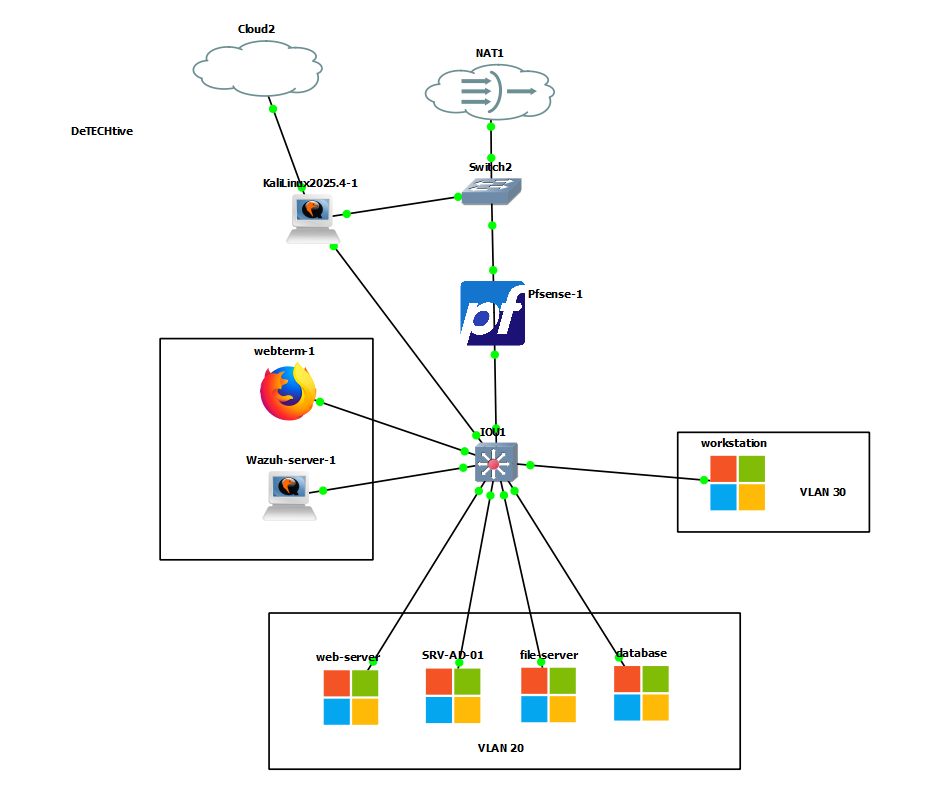

# 🕵️‍♂️ Detechtive Agency - Secure Infrastructure & Intranet

> **Projet de fin d'études - Certification AIS (Administrateur d'Infrastructures Sécurisées)**
> *RNCP Niveau 6 - Jedha Bootcamp - 2026*

---

## 📖 À propos

**Detechtive Agency** est un projet de mise en situation réelle simulant le déploiement d'une infrastructure sécurisée pour une agence de renseignement. Le projet couvre la conception de l'architecture réseau, la virtualisation, le durcissement des systèmes (Hardening) et le développement d'un intranet métier interconnecté aux services d'infrastructure critiques.

🎯 **Objectif :** Démontrer la capacité à concevoir une architecture **"Secure by Design"** en segmentant le réseau, en chiffrant les communications de bout en bout et en assurant l'interopérabilité entre une application Web et un domaine Active Directory.

---

## 🏗️ Architecture & Infrastructure

L'infrastructure est entièrement virtualisée et émulée via **GNS3**. Elle repose sur une segmentation stricte (VLANs) pour limiter les mouvements latéraux et la surface d'attaque.

### 🗺️ Topologie Réseau
Le réseau est cloisonné en zones de sécurité, filtrées par un pare-feu **pfSense** qui agit comme passerelle par défaut et routeur inter-VLAN.

| Zone | VLAN | CIDR | Services Hébergés |
| :--- | :---: | :--- | :--- |
| **Management & Sécurité** | `10` | `192.168.10.8/29` | Serveur SIEM (Wazuh), Webterm d'administration |
| **Serveurs (DMZ Interne)** | `20` | `192.168.10.16/28` | Web App, Contrôleur de Domaine (AD), File Server, BDD |
| **Postes Clients** | `30` | `192.168.10.128/25` | Workstations des agents (Windows) |
| **Zone Externe** | `-` | `WAN` | Poste Attaquant (Kali Linux) pour Pentest |

### 📸 Vue Logique (GNS3)
La topologie met en évidence le nœud central de commutation et la distribution des services critiques en VLAN 20.

*Schéma conceptuel et plan d'adressage IP :*

---

## 🛠️ Stack Technique

### 🖥️ Virtualisation & Réseau
* **Hyperviseur / Émulateur :** GNS3 (Gestion de la topologie), VMware Workstation.
* **Sécurité Périmétrique :** pfSense (Firewalling, NAT, Routing, DHCP).
* **Supervision de Sécurité :** Wazuh (SIEM & XDR) pour la remontée d'alertes.

### ⚙️ Systèmes & Services (Full Windows)
Toute l'infrastructure serveur repose sur **Windows Server 2022** pour assurer une cohérence d'administration via l'Active Directory.

* **Serveur AD (SRV-AD-01) :** Active Directory DS, DNS.
* **Serveur de Fichiers (FS) :** Stockage des preuves, partages SMB sécurisés, quotas.
* **Serveur Web :**
    * OS : Windows Server 2022.
    * Serveur HTTP : Apache (XAMPP/WAMP customisé).
    * Langage : PHP 8.x.
* **Serveur Base de Données :**
    * OS : Windows Server 2022.
    * SGBD : MariaDB (MySQL).

### 💻 Application Intranet ("Detechtive Dashboard")
* **Frontend :** HTML5 / CSS3 (Design "Terminal" immersif).
* **Backend :** PHP Natif sécurisé.
* **Outils de gestion de projet :** Trello (Kanban), Excalidraw (Schématisation).

---

## 🔐 Implémentations Sécurité (Focus AIS)

Ce projet met en œuvre des mécanismes de défense en profondeur, allant du réseau à la couche applicative :

### 1. Chiffrement des Flux Critiques
* **HTTPS Strict :** L'application web n'est accessible que via TLS (Certificat auto-signé ou autorité privée).
* **Database SSL/TLS :** La connexion entre le backend PHP et la base de données MariaDB est chiffrée.
    * *Détail technique :* Utilisation de `PDO::MYSQL_ATTR_SSL_CA` pointant vers le certificat CA (`ca-cert.pem`) pour prévenir les attaques Man-in-the-Middle.
* **Vérification Active :** Le dashboard affiche en temps réel le statut du chiffrement SQL (`Ssl_cipher`).

### 2. Gestion des Identités & Interopérabilité
* **Authentification Centralisée :** Les utilisateurs sont gérés via l'Active Directory.
* **Interopérabilité PHP ↔ SMB :** L'application web ne stocke pas les fichiers localement. Elle s'authentifie dynamiquement sur le File Server via une commande système (`net use`) pour monter les partages sécurisés uniquement le temps de la session, garantissant que les preuves restent dans la zone de stockage dédiée.

### 3. Sécurité Applicative (DevSecOps)
* **Upload Sécurisé :**
    * Whitelist d'extensions stricte (jpg, png, pdf, docx...).
    * Renommage forcé des fichiers pour éviter les injections de commandes via le nom.
    * Vérification de la taille (Max 5Mo).
* **Protection SQL :** Utilisation systématique de requêtes préparées (`PDO`) pour contrer les injections SQL.
* **Gestion d'erreurs :** Mode "Silencieux" en production (pas d'affichage de stack trace à l'utilisateur) avec un système de fallback (mode dégradé) si le SSL échoue, tout en alertant l'administrateur.

---

## 🚀 Installation / Déploiement (Simulation)

> ⚠️ **Note :** Le code source complet est privé. Ce dépôt sert de vitrine technique.

Pour reproduire cet environnement sous GNS3 :
1.  Importer les appliances (PfSense, Windows Server 2022, Kali, Webterm).
2.  Configurer les interfaces VLAN sur le switch virtuel (IOU/vSwitch).
3.  Déployer les règles de pare-feu PfSense pour isoler la DMZ (VLAN 20).
4.  Initialiser l'Active Directory et joindre les serveurs Web, BDD et FS au domaine `detechtive.local`.

---

*Projet réalisé dans le cadre de la certification RNCP Niveau 6 "Administrateur d'Infrastructures Sécurisées".*
